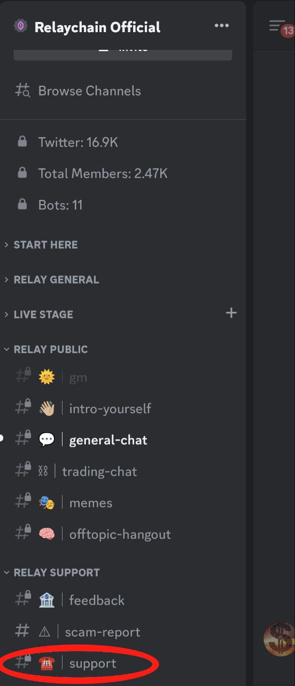
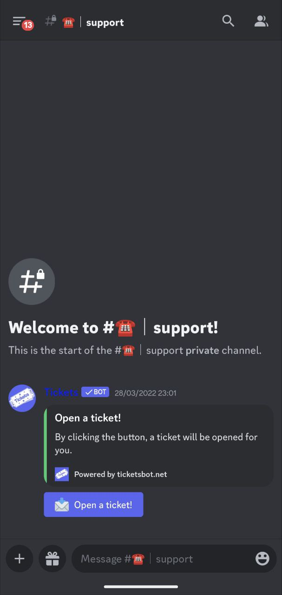

# User Support

Please visit our [Discord ](https://discord.gg/relaychain)and raise a support ticket.

### Steps

1. Join Discord and navigate to the Support channel

<figure><figcaption></figcaption></figure>

2. Choose "Open a ticket"

<figure><figcaption></figcaption></figure>

2. Provide details of your issue.
3. If it is a stuck transaction, provide the blockchain transaction ID and where you were bridging to.
4. A member of the Relay support team will help you in the order your ticket was received.&#x20;

