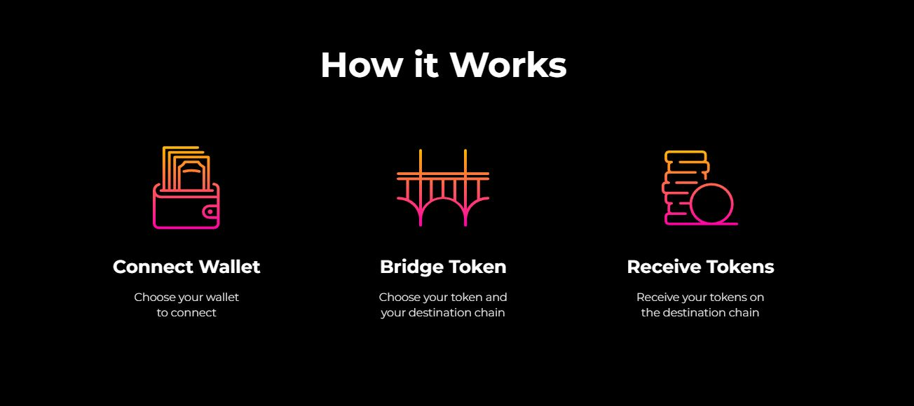

# 🧙┃How to Use RelayChain

<figure><figcaption></figcaption></figure>

DeFi bridges connect disparate blockchain networks, allowing users to move tokens freely between “islands.” Using RelayChain to bridge (move) tokens between blockchains is easy:

### Steps

1\. Navigate to [https://www.relaychain.com/](https://www.relaychain.com/) and launch the App.

2\. Connect to the site using MetaMask or WalletConnect.

3\. Set your wallet to the correct origin chain network.

4\. Select whether you want to Bridge or Bridge & Swap to a different token on the destination chain.

5\. Select the destination network on the RelayChain site.

6\. Use the drop-down menu to select the token you wish to bridge from the origin chain.

7\. Enter the quantity of the tokens you wish to bridge between the chains. The amount available to bridge and associated fees will appear. You will also see which underlying bridge will route your transaction. Our bridge aggregator selects this route automatically in the background.

8\. Execute the transaction (this may require two approvals in your wallet if you haven’t used RelayChain before).

9\. Confirm the bridge transaction’s progress and success in the history tab.

\
